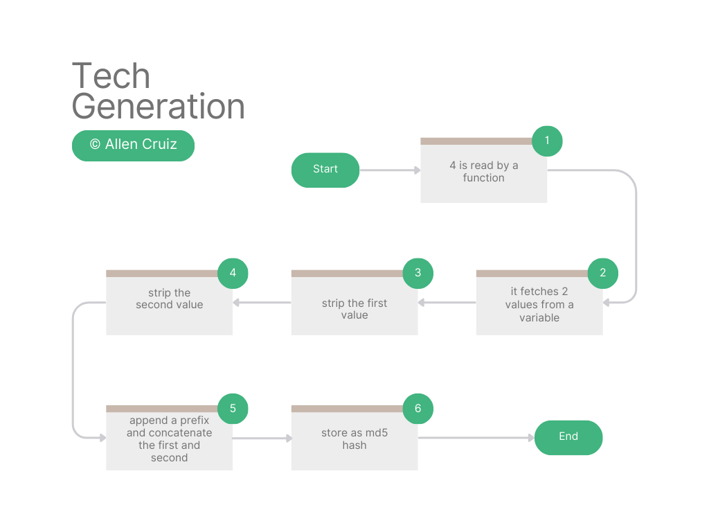

# ZLT-S12-PRO

A repository for password cracking of TOZED S12 PRO (Philippines) working with latest versions (Doesn't require flashing)

> [!NOTE]
> I haven't tested my findings yet with devices outside Philippines but in theory it should work.

## Preamble

ZLT S12 Pro is a CAT6 LTE device by SZTOZED running on a highly modified build of OpenWRT

### User Types

The device has three types of users: **Web User**, who has limited access to the system; **General User**(tech), who has the same UI as the General User but with additional tools under the settings; and **Senior User**(superadmin), who has full access to the system, including unlocking the device and other critical functionalities.

### Param file

The tozed-param file holds the critical configuration for generating password for each user and some other device settings, I'm not gonna dive with the other stuff as we will mainly focus in password generation of the two accounts **Tech** and **Senior**

#### General

```bash
export TZUSER_WEB_GENERAL_USER_NAME="tech"
export TZUSER_WEB_GENERAL_USER_PWD_RANDOM="y"
export TZUSER_WEB_GENERAL_USER_PWD="@l03e1t3"
export TZUSER_WEB_GENERAL_USER_PWD_RANDOM_WAY="4"
```

These lines of export commands are responsible for generating the password for the tech account. At first glance, you might think the password would be **@l03e1t3**, as stated in `export TZUSER_WEB_GENERAL_USER_PWD="@l03e1t3"`. However, you would be mistaken. Based on `export TZUSER_WEB_GENERAL_USER_PWD_RANDOM="y"`, PWD_RANDOM is set to **y**, which overwrites the specified password for the general user.

In theory, you can change it to **n**, set your own USER_PWD, and remove the line `export TZUSER_WEB_GENERAL_USER_PWD_RANDOM_WAY="4"`. However, I haven't tested this yet, so it's up to you to explore. Be aware that doing so will require you to reflash the device, which increases the risk of bricking it.

Holding on to **4** this is a parameter sent to a function which determines the way of password generation heres a chart visualizing the process:



#### Senior

```bash
export TZUSER_WEB_SENIOR_USER_NAME="superadmin"
export TZUSER_WEB_SENIOR_USER_PWD_RANDOM="y"
export TZUSER_WEB_SENIOR_USER_PWD="12345678"
export TZUSER_WEB_SENIOR_USER_PWD_RANDOM_WAY="5"
```

It is the same as with the General user but the password generation is very complex

#### Show Hidden Settings

> [!NOTE]
> This is temporary and after every reset, the device will revert back to being locked.

The current Senior user is restricted to a certain level. We need to change the level to '1' for it to work. You need to find `api.lua` and edit it as follows:

```lua
elseif (userSign == 'TZ_SUPER_USERNAME') then
	tz_answer["auth"] = web_info["web_operator_show_hide_pref"]
    tz_answer["level"] = "2"
```

#### TODO

    - Permanently show hidden superadmin settings

### Contact Me

Email: cruizallen2@gmail.com

<p align="center">Copyright <b>Allen Cruiz</b> 2025</p>
